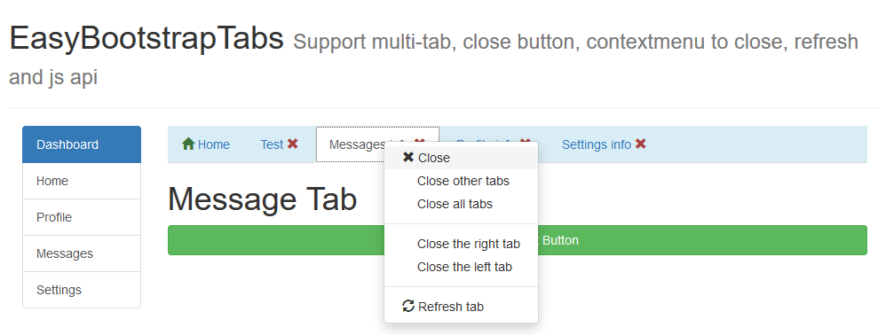
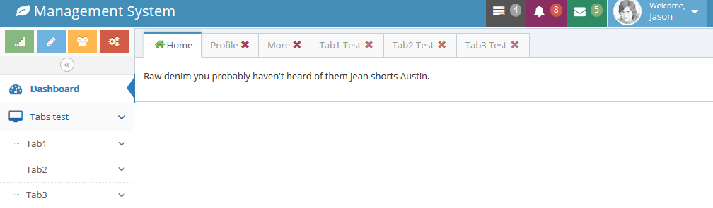
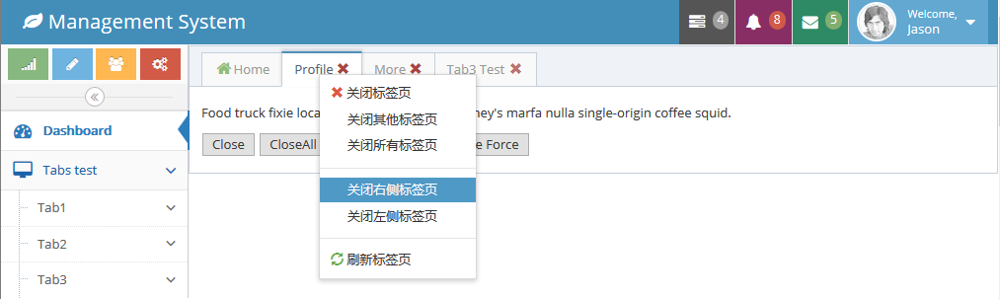

# EasyBootstrapTabs

**EasyBootstrapTabs 是针对 Bootstrap3(及基于 Bootstrap3 的其他 UI 框架，如 ACE 等等) Togglable tabs 的扩展插件。**

**为 Bootstrap 提供多标签页创建，关闭按钮，右键菜单关闭，刷新及标签管理 API。**


**EasyBootstrapTabs is an extension to Togglable tabs for Bootstrap3 (and other UI frameworks based on Bootstrap3, such as ACE, etc.).**

**Provide multi-tab create, close button, right-click menu close, refresh and js API.**


## Feature/特点

- **中文**

	- 多标签创建，关闭，关闭记忆
	
	- 右键菜单：关闭，关闭其他，关闭所有，关闭左侧，关闭右侧，刷新
	
	- JavaScript API：`addTab`, `removeTab`, `removeAllTab`, `selectTab`, `refreshTab`


- **English**

	- Multi-label creation, closing, closing memory

	- right-click menu: close, close other, close all, close left, close right, refresh

	- JavaScript API: `addTab`,` removeTab`, `removeAllTab`,` selectTab`, `refreshTab`

## Demo







## Installation/安装

- Download install/下载安装

- Npm install/Npm 安装

	```BASH
	npm install easybootstraptabs
	```

## 	Get Started/开始使用

### Tab structure/Tab 结构
```HTML
<!-- Nav tabs -->
<ul class="nav nav-tabs bg-info" role="tablist" id="myTab">
	<li role="presentation" class="active">
		<a href="#home" aria-controls="home" role="tab" data-toggle="tab">
			Home
		</a>
	</li>
	<li role="presentation">
		<a href="#test" aria-controls="profile" role="tab" data-toggle="tab">
			Test 
			<!-- Add close button-->
			<span class="glyphicon glyphicon-remove" aria-hidden="true"></span>
		</a>
	</li>

</ul>
<!-- Tab panes -->
<div class="tab-content">
	<div role="tabpanel" class="tab-pane active" id="home">Home</div>
	<div role="tabpanel" class="tab-pane" id="test">
		<h1>Test API</h1>
	</div>
</div>
```

### EasyBootstrapTabs initialization/初始化 

```HTML
<!-- jQuery -->
<script src="../lib/jquery.min.js" type="text/javascript" charset="utf-8"></script>
<!-- Bootstrap3 -->
<link rel="stylesheet" type="text/css" href="../lib/bootstrap3/css/bootstrap.min.css" />
<script src="../lib/bootstrap3/js/bootstrap.min.js" type="text/javascript" charset="utf-8"></script>

<!-- EasyBootstrap START-->
<!-- Close button style-->
<style type="text/css">
	#myTab span.glyphicon-remove {
		cursor: pointer;
		color: #a94442
	}
	#myTab span.glyphicon-remove:hover {
		cursor: pointer;
		color: #D72A1F
	}
</style>
<!-- plugin&languages -->
<!-- jquery.contextify.min.js -->
<script src="../lib/jquery.contextify.min.js" type="text/javascript" charset="utf-8"></script>
<script src="../dist/easy.bootstrap.tabs.min.js" type="text/javascript" charset="utf-8"></script>
<script src="../dist/lang/easy.bootstrap.tabs-lang-en.js" type="text/javascript" charset="utf-8"></script>

<script type="text/javascript">
	// EasyBootstrapTabs init
	EasyBootstrapTabs.init('#myTab');
</script>
<!-- EasyBootstrap END-->
```	

## JavaScript API


- **addTab**

	```
	/**
	 * add Tab
	 * @param {Object} id tab id, unique
	 * @param {Object} text, tab text
	 * @param {Object} url, load content url
	 * @param {Object} params optional; url params data
	 */
	addTab: function(id, text, url, data)
	```

- **removeTab**
	```
	/**
	 * Remove tab by id
	 * @param {String} id tab id
	 * @param {Boolean} Optional; Remove the tab include without close button tab 
	 */
	removeTab: function(id[, force]) 
	```

- **removeAllTab**

	```
	/**
	 * Remove all tabs
	 * @param {Boolean} Optional; Remove the tab include without close button tab 
	 */
	removeAllTab: function(force) 
	```


- **selectTab**

	```
	/**
	 * Show tab by id
	 * @param {String} id
	 * @return {Boolean} Is checked; if does not exist return false
	 */
	selectTab: function(id)  
	```

- **refreshTab**

	```
	/**
	 * Use tab url refresh tab; if there is no url is not refreshed
	 * @param {Object} id tab id
	 */
	refreshTab: function(id)
	```


## End

Email：<inthinkcolor@gmail.com>

[http://www.easyproject.cn](http://www.easyproject.cn "EasyProject Home")


**支付宝钱包扫一扫捐助：**

我们相信，每个人的点滴贡献，都将是推动产生更多、更好免费开源产品的一大步。

**感谢慷慨捐助，以支持服务器运行和鼓励更多社区成员。**

</img>


We believe that the contribution of each bit by bit, will be driven to produce more and better free and open source products a big step.

**Thank you donation to support the server running and encourage more community members.**

[](https://www.paypal.me/easyproject/10 "Make payments with PayPal - it's fast, free and secure!")


